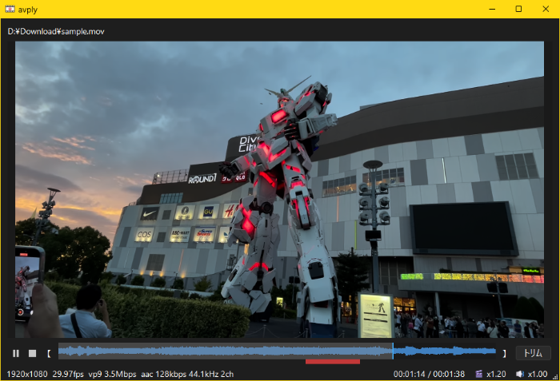

# avply

会議録画を「速く・聞きやすく・必要な所だけ」見直すためのメディアプレイヤー。
起動の速さと、倍速・音声強調・キーフレームトリムで視聴時間を削る。
起動が軽いため、会議録画に限らず普段の動画・音声再生にも使える。



## 機能

- **高速起動**  
軽量な Qt Widgets ベースの最小構成で、起動から再生可能になるまでが速い。
- **対応ファイル形式**
    - 動画：mp4, mkv, mov, avi, webm
    - 音声：mp3, wav, flac, ogg, opus

    音声ファイル時はプレビュー領域を省略したコンパクト UI に切り替わる。
- **シークバープレビュー**  
シークバー上のマウスホバーで、その位置のフレームサムネイルと再生時刻を MPC-HC 風のポップアップで表示する。
- **音声波形表示**  
ファイル読込後に ffmpeg で音声波形を非同期解析し、シークバー上段へ重ねて描画する。音声ストリームが無い場合は中央基線で代替する。
- **会議録画向け再生支援**  
    - **再生速度変更**：ピッチ補正付きで等速〜数倍速まで切替可能（ファイル切替後も保持）
    - **音声強調**：WebRTC Audio Processing（ノイズ抑制 + 自動ゲイン制御 + ハイパスフィルタ）で話者間の音量バラつきを自動で均し、小さく録れた発言を持ち上げる
- **高速トリム**  
範囲指定した区間を再エンコードせずキーフレーム単位で切り出す。入力と同じコーデック・コンテナのままディスクコピー速度近くで保存する。
- **変換**  
動画は NVIDIA GPU（NVENC）で AV1 + Opus 96kbps、音声は libopus 96kbps へ再エンコードする。QWXGA（2048px）超の映像は縦横比を維持して自動縮小する。

## 動作要件

- Windows 11
- [ffmpeg](https://www.gyan.dev/ffmpeg/builds/)（別途インストール）  
  再生時もメディア情報の取得に ffprobe を使用するため、変換・トリムを行わない場合でも必要だ。
- NVIDIA GPU（**動画を「変換」する場合のみ必要。** AV1 NVENC 対応 / RTX 30 シリーズ以降推奨。トリムはストリームコピーのため GPU 不要。音声のみの変換も CPU の libopus で動作するため不要）

## インストール方法

### Scoop 経由（推奨）

```powershell
scoop bucket add nikai https://github.com/aviscaerulea/scoop-bucket
scoop install nikai/avply
```

依存パッケージとして ffmpeg も自動でインストールされる。

### 手動インストール

[Releases](https://github.com/aviscaerulea/avply/releases) から `avply-<version>-x64.zip` をダウンロードして展開し、`avply.exe` を起動する。
ffmpeg は別途インストールが必要だ。（`scoop install ffmpeg` または [公式ビルド](https://www.gyan.dev/ffmpeg/builds/)）

### ffmpeg パスの解決順

avply は以下の優先順で ffmpeg を解決する。

1. `avply.toml` / `avply.local.toml` の `[ffmpeg].path` で明示指定
2. scoop の既定パス `%USERPROFILE%/scoop/apps/ffmpeg/current/bin/ffmpeg.exe`
3. `PATH` 環境変数から `ffmpeg.exe` を解決

scoop または `PATH` 配下に ffmpeg があれば設定不要で動作する。
明示指定する場合は以下のように記述する。

```toml
[ffmpeg]
path = "C:/Users/yourname/scoop/apps/ffmpeg/current/bin/ffmpeg.exe"
```

PC 固有のパスを管理から外したい場合は `avply.local.toml` に同キーを記述する。（後勝ち、VCS 管理外）

## 使用方法

### ファイルの読み込み

以下のいずれかの方法で読み込める。

- 右クリック →「ファイルを開く」を選択（読込済みなら同フォルダ、未読込ならホームフォルダを初期表示）
- アプリウィンドウへドラッグ＆ドロップ
- `avply.exe` 自体へのドラッグ＆ドロップ、Windows の「送る」、「プログラムを指定して開く」
- コマンドラインから `avply.exe <メディアファイル>` の形式で起動

読み込み中のファイル名はウィンドウタイトル（`avply - ファイル名.拡張子`）に表示する。
同じファイルを再度読み込むと先頭から再生し直す。

### キー / マウス操作一覧

| 操作 | キー | マウス |
|------|------|--------|
| <sub>再生機能</sub><br>再生 / 停止 | スペース | プレビュー領域クリック（音声時は不可） |
| <sub>再生機能</sub><br>シーク | ← → | シークバードラッグ<br>シークバー・プレビュー領域のホイール |
| <sub>再生機能</sub><br>再生速度 ±0.05 倍 | `.` 速く / `,` 遅く | Ctrl+ホイール |
| <sub>再生機能</sub><br>音量 ±0.05 | ↑ ↓ | Shift+ホイール |
| <sub>再生機能</sub><br>音声強調強度切替<br>（Off → 標準 → 強 → Off） | N | |
| <sub>再生機能</sub><br>再生条件一括リセット | g | |
| <sub>トリム機能</sub><br>区間開始位置を指定 | `[` | 【 ボタン |
| <sub>トリム機能</sub><br>区間終了位置を指定 | `]` | 】 ボタン |
| <sub>トリム機能</sub><br>区間のみクリア（再生位置は維持） | R | |
| <sub>トリム機能</sub><br>トリム実行 / 中断 | | ✂ ボタン |

### 再生

再生速度はファイルを切り替えても保持される。
g キーは 1 回目で中立値（速度 1.00 / 音量 100% / 音声強調 Off）、2 回目で起動時のデフォルト値へ復元する。リセット状態のまま手動で各値を変更すると、次の g 押下は再び「一括リセット」として動作する。

ステータスバーには現在の再生速度・音量に加え、音声強調の強度を常時表示する（`Clarity:0〜2`、0=Off、1=標準、2=強）。

### トリム

区間を指定してからトリム実行する。シークバー上の指定区間は赤でハイライト表示される。
再エンコードしないため、開始位置はキーフレームに丸められる。Ogg/Opus など一部コンテナでは `-c copy` の仕様上、カット直後の再生位置が数十ミリ秒ズレることがある。

### 変換

右クリック →「ファイルを変換する」で実行する。動画は AV1 + Opus、音声は libopus 96kbps のみへ再エンコードする。

### 出力ファイル

入力ファイルと同じフォルダに `<元ファイル名>_mod.<拡張子>` として出力される。
既に `_mod`（または `_mod2` など）が付いたファイルを再処理すると、同じ名前へ上書き保存される。
`_mod` なしの入力で出力先に同名ファイルが既に存在する場合は、`_mod2`、`_mod3` とシーケンス番号が付く。

| モード | 入力 | 出力拡張子 |
|--------|------|-----------|
| 変換 | 動画 | `.mp4`（AV1 + Opus） |
| 変換 | 音声 | `.opus`（libopus） |
| トリム | 動画・音声 | 入力と同じ |

### その他

右クリックメニューの設定サブメニューから、再生中の topmost・シングルインスタンス強制・プロセス優先度を変更できる（レジストリに保存）。

### 設定ファイル

`avply.toml`（ローカル上書きは `avply.local.toml`）で再生速度・音量・シーク量・音声強調など各種挙動をカスタマイズできる。各キーの説明・既定値・調整範囲は `avply.toml` 内のコメントを参照する。

## ビルド方法

### 必要ツール

- Visual Studio 2022+ Build Tools（C++ ワークロード）
- CMake 3.25+（`scoop install cmake`）
- Qt 6.10.3 MSVC2022 x64
  - `python -m aqt install-qt windows desktop 6.10.3 win64_msvc2022_64 --outputdir <インストールフォルダ> --modules qtmultimedia`
  - インストールフォルダは `CMakePresets.json` の `CMAKE_PREFIX_PATH` に合わせること

### ビルド手順

```powershell
pwsh.exe -File build.ps1
```

実行ファイルは `out/Release/avply.exe` に生成される。

## 技術仕様

- 言語：C++17
- GUI フレームワーク：Qt 6.10 Widgets + Multimedia（LGPLv3、DLL 動的リンク）
- 音声時間圧縮：SoundTouch 2.4.0（LGPL v2.1+、静的リンク）
- 音声強調：WebRTC Audio Processing（BSD、静的リンク）
- 映像コーデック：AV1（av1_nvenc, VBR CQ 28, preset p6）
- 音声コーデック：Opus 96kbps（libopus）
- ハードウェアアクセラレーション：NVIDIA NVENC（CUDA、動画変換時のみ使用）
- 外部ツール連携：ffmpeg / ffprobe（QProcess 経由）

## ライセンス

avply 本体は **GNU LGPL v3** で配布する。全文は同梱の `LICENSE`（LGPL v3）および `COPYING`（GPL v3）を参照。

依存ライブラリのライセンス対応：

- Qt 6.10（LGPLv3）：windeployqt が配布する DLL を動的リンクする。利用者は同名 DLL を差し替えることで Qt を入れ替えられる
- SoundTouch 2.4.0（LGPL v2.1+）：静的リンクのため、本体ライセンスを LGPL v3 とすることで再リンク権を確保する
- WebRTC Audio Processing（BSD）：静的リンク。BSD は LGPL v3 と両立し、再配布上の追加義務は生じない
- ffmpeg：QProcess による外部プロセス呼び出しのため、リンク関係は発生しない
