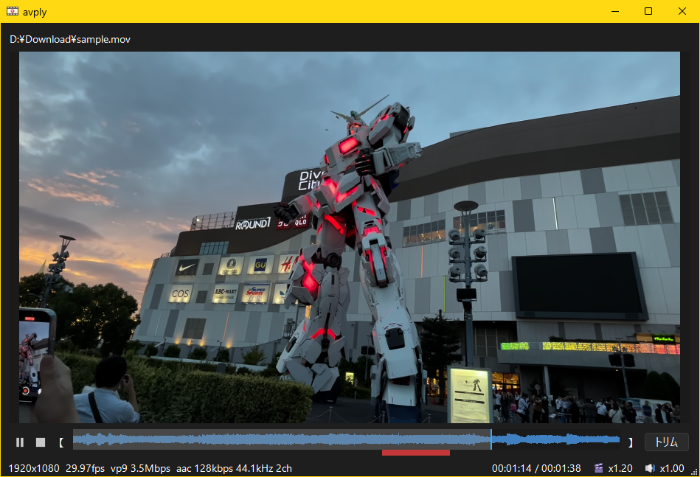

[](../index.md)
[](index.md)

# How to use avply

avply is a media player for reviewing meeting recordings quickly, clearly, and only where it matters.
This page explains the screen, the keyboard controls, and features such as subtitles.
For installation, see the [README](https://github.com/aviscaerulea/avply/blob/main/README.en.md#installation).



## Loading a file

You can load a file in any of the following ways.

- "Open file" in the right-click menu
- Drag and drop onto the window
- Drag and drop onto `avply.exe`, or use "Send to" / "Open with" in Windows
- Run `avply.exe <media file>` from the command line

Loading the same file again restarts playback from the beginning.
When you load an audio file, the window switches to a compact layout without the preview area.

## Reading the screen

The status bar at the bottom shows the following, from left to right.

| Display | Meaning |
| --- | --- |
| `1920x1080 30fps h264 ...` | Resolution, frame rate, and codecs of the loaded file |
| `00:12:34 / 01:00:00` | Current position and total length |
| 🎬 `x1.00` | Playback speed |
| 🔊 `100%` | Volume |
| `Clarity:OFF` | Voice enhancement state (ON / OFF) |
| `Subtitle:OFF` | Subtitle state (see the table below) |

The subtitle display takes the following states.

| Display | State |
| --- | --- |
| `Subtitle:OFF` | Subtitles are not in use |
| `Subtitle:DL 42%` | Downloading the speech recognition model. The number is how much has arrived |
| `Subtitle:42%` | Recognizing speech. The number is how much has been recognized |
| `Subtitle:ON` | Recognition has finished and subtitles can be shown |
| `Subtitle:N/A` | The file is audio-only, or the video has no audio |
| `Subtitle:ERR` | The download or the recognition failed. The reason is in `avply.log` next to `avply.exe` |

## Keyboard and mouse

Playback controls are as follows.

| Action | Key | Mouse |
| --- | --- | --- |
| Play / pause | Space | Click the preview area (not available for audio-only files) |
| Seek | ← → | Drag the seek bar, or scroll over the seek bar or preview area |
| Large seek | Shift+← / Shift+→ | |
| Step one frame forward / back | Ctrl+→ / Ctrl+← | |
| Previous / next file in the folder | Alt+← / Alt+→ | |
| Playback speed ±0.05x | Ctrl+↑ faster / Ctrl+↓ slower | Ctrl+wheel |
| Volume ±0.05 | ↑ ↓ | Shift+wheel |
| Switch voice enhancement | C | Right-click menu |
| Switch subtitles | S | Right-click menu |
| Reset playback settings | G | |

Trimming controls are as follows.

| Action | Key | Mouse |
| --- | --- | --- |
| Set the start of the range | `[` | 【 button |
| Set the end of the range | `]` | 】 button |
| Clear the range only (playback position kept) | R | |
| Run / cancel trimming | | ✂ button |

The first press of G returns to neutral values (speed 1.00, volume 100%, voice enhancement off), and the second press restores the speed and volume from startup.
Frame stepping pauses playback first, and is not available for audio-only files.
File switching follows the file-name order and stops at the first and last files in the folder.
Hovering over the seek bar shows a thumbnail and timestamp for that position.

## Voice enhancement

In meeting recordings, remarks made far from the microphone sound quiet while nearby ones sound loud.
Voice enhancement combines noise suppression and automatic gain control to even out that difference during playback.
The C key or "音声強調（Clarity）" in the right-click menu toggles it on and off.
It always starts off at launch, and the setting is not saved.

## Subtitles

The audio of a video is recognized with whisper.cpp, and subtitles are overlaid at the bottom of the picture.
The S key or "字幕（Subtitle）" in the right-click menu toggles it on and off.
It always starts off at launch, and the setting is not saved. It stays on when you switch files.

Recognition proceeds from the beginning, and subtitles appear once it has passed the playback position.
If you seek to a position that has not been recognized yet, no subtitles appear until recognition catches up.
Results are cached per video, so they show without waiting from the second time on.
Audio files are not supported.

The speech recognition engine is built into avply, so there is no other software to install.
The first time you turn subtitles on, avply asks and then downloads the recognition model.
A GPU is used automatically when available, and the CPU otherwise.
See [Subtitle models and GPU](whisper-setup.md) for how to pick a model and check the GPU.

## Trimming and conversion

Select a range first, then run the trim.
The selected range is highlighted in red on the seek bar.
Because nothing is re-encoded, saving runs at close to disk-copy speed.

Conversion runs from "Convert file" in the right-click menu.
Video is re-encoded to AV1 + Opus, and audio to Opus at 96kbps.
Video wider than 2048px is scaled down automatically while keeping its aspect ratio.
Video conversion requires an NVIDIA GPU with AV1 NVENC support.

## Output files

Output goes to the same folder as the input, named `<original name>_mod.<extension>`.
If that name already exists, a number is appended, as in `_mod2` or `_mod3`.
Processing a file that already has a `_mod` suffix overwrites the file with the same name.

| Mode | Input | Output extension |
| --- | --- | --- |
| Conversion | Video | `.mp4` (AV1 + Opus) |
| Conversion | Audio | `.opus` |
| Trimming | Video and audio | Same as the input |

## Configuration

Behavior is adjusted in `avply.toml`, located in the same folder as the executable.
To keep machine-specific values, create `avply.local.toml` in that folder and write the same keys; those values take precedence.
The main entries are listed below. Default values and valid ranges for each key are documented in the comments inside `avply.toml`.

| Section | Contents |
| --- | --- |
| `[ffmpeg]` | Path to ffmpeg.exe |
| `[seek]` | Seek amounts for arrow keys and the wheel |
| `[playback]` | Initial playback speed, hardware decoder priority |
| `[window]` | Maximum window size on load (ratio of the monitor) |
| `[audio]` | Initial volume, silence tone |
| `[subtitle]` | Subtitle model, download source, recognition language, context given to recognition |

The ffmpeg path is resolved in this order: `path` under `[ffmpeg]`, the default Scoop location, then the `PATH` environment variable.
No configuration is needed if it is available through Scoop or `PATH`.
To set it explicitly, write it as follows.

```toml
[ffmpeg]
path = "C:/Users/yourname/scoop/apps/ffmpeg/current/bin/ffmpeg.exe"
```

The default subtitle model is downloaded automatically. To use another one, write its name in `model` under `[subtitle]`.
When proper nouns or technical terms are not picked up well, write a single sentence containing them in `prompt`; recognition then leans toward those words. They are not guaranteed to appear.

```toml
[subtitle]
model = "ggml-small.bin"
prompt = "This is a meeting about the Hoge management system, Fuga terminals, and Piyo notifications."
```

Changing `model` or `prompt` re-runs recognition, even for a video recognized before.

Always-on-top during playback, single-instance enforcement, and process priority are toggled from "設定" (Settings) in the right-click menu.
These are stored in the registry and kept for the next launch.
